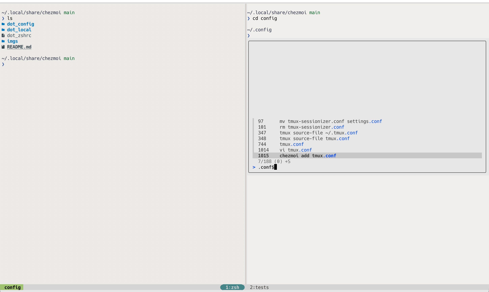

# My Dotfiles

> Managed using [chezmoi](https://github.com/twpayne/chezmoi)

## Picture

## Instructions

1) `brew install chezmoi`

2) `chezmoi init <github-username>`

3) `chezmoi diff`

4) `chezmoi apply`

### TODO

- git configurations:
  - git delta
  -
- tmux
  - sesh/zshrc, list the icons for active sessions
