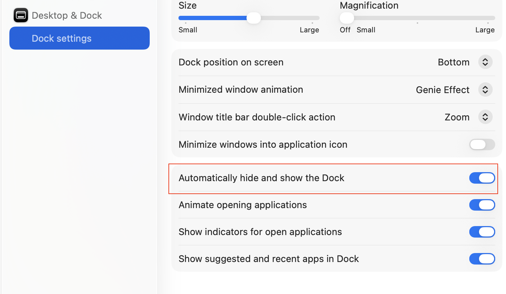
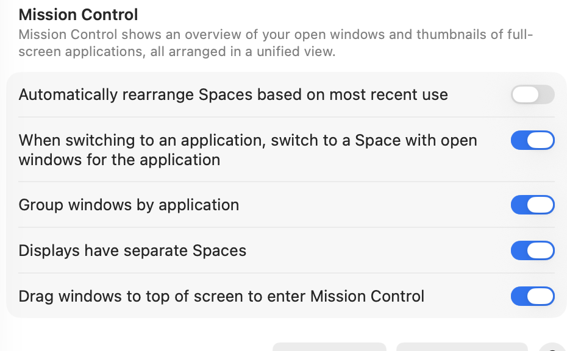
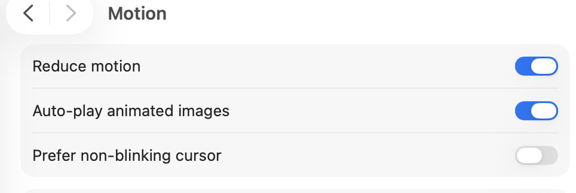
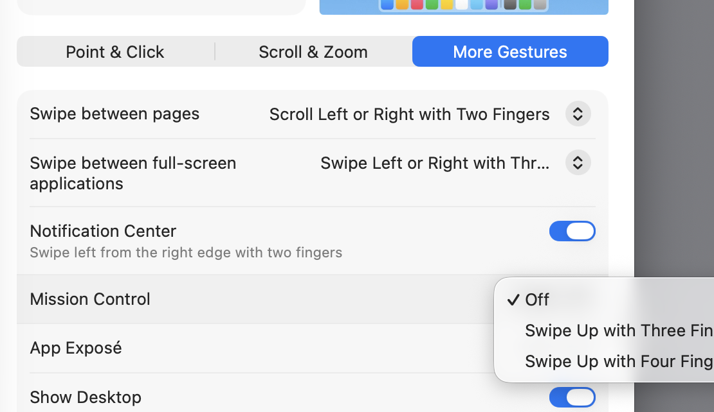

# Settings to configure on MacOS

## 1. Hide Dock and remove delay



```
defaults write com.apple.dock autohide-delay -float 0
```

## 2. Mission Control Settings



## 3. Reduce Motion



## 4. Disable Swipe Gesture


